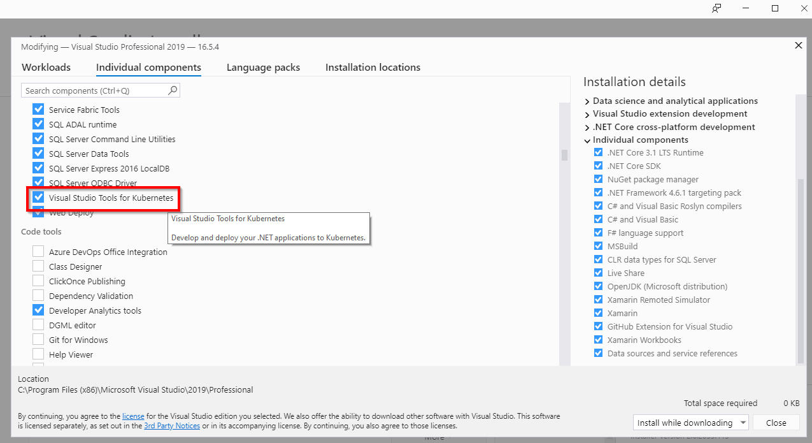
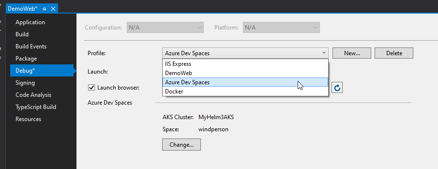
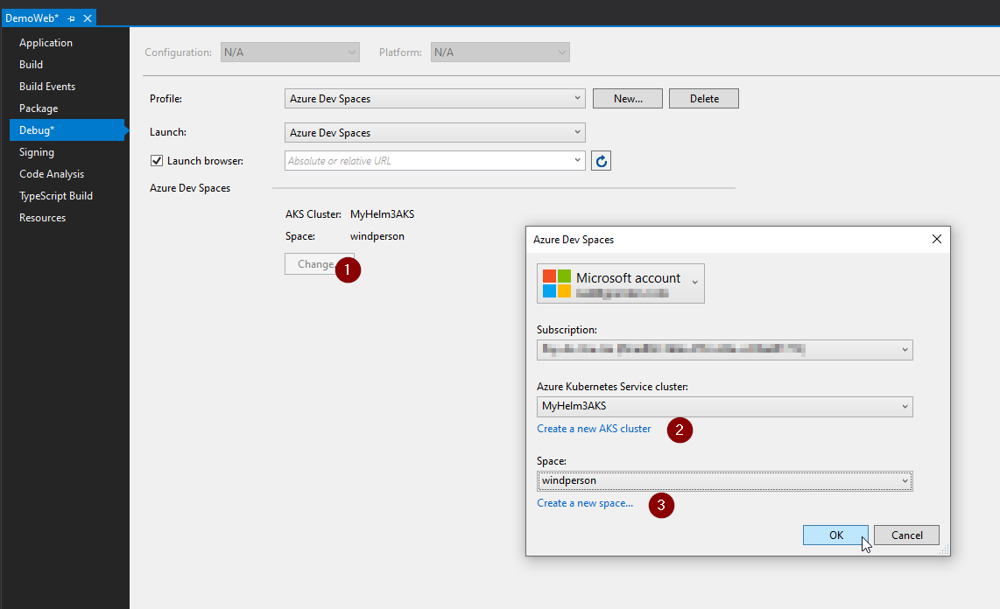
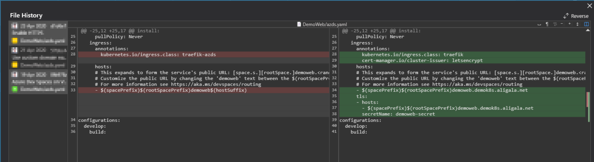

# Visual Studio link to existing Azure Dev Spaces

Official docs:   
https://docs.microsoft.com/en-us/azure/dev-spaces/get-started-netcore-visualstudio

## Prerequisites

### Software

* Visual Studio Kubernetes Tools:   
https://docs.microsoft.com/en-us/visualstudio/containers/tutorial-kubernetes-tools   

## Link to existing Azure Dev Spaces

1. Open Project Property Debug Page, select **Azure Dev Spaces**:   
    
2. Select the AKS service that Azure Dev Spaces enabled, then select or create a namespace:
    
3. Be sure to modify `azds.yml` file to match the custom domain name and HTTPS SSL certificate if the Azure Dev Space has config [that](./service_create.md):   
    
