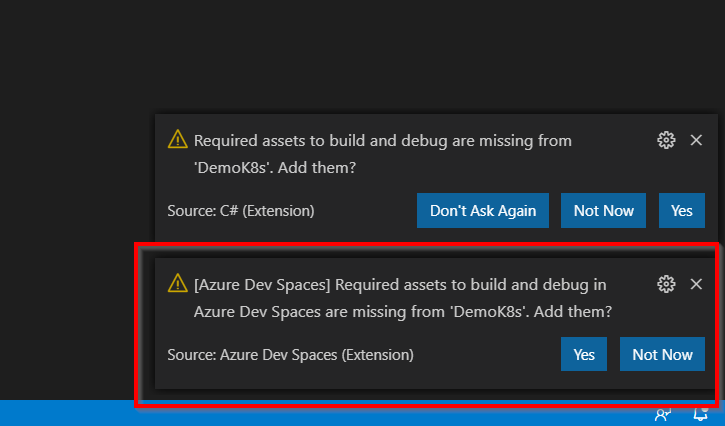
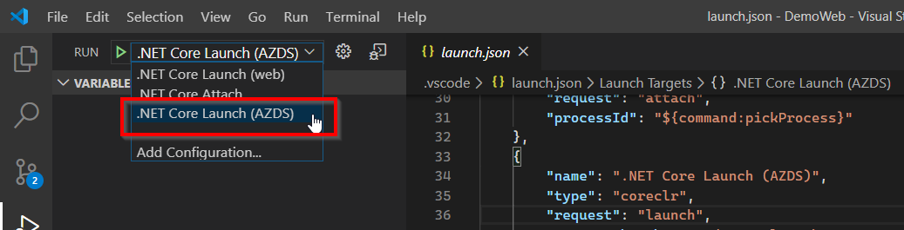
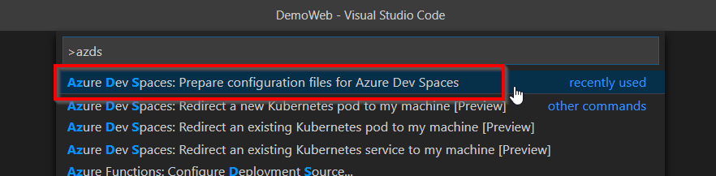
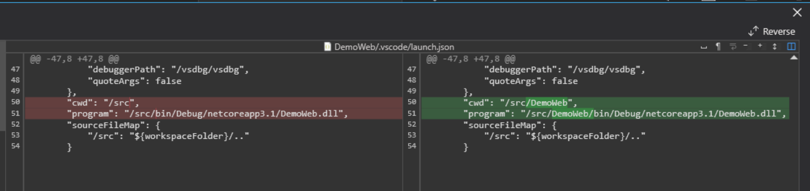

# Visual Studio Code link to existing Azure Dev Spaces

Official docs:   
https://docs.microsoft.com/en-us/azure/dev-spaces/get-started-netcore

## Prerequisites

### Software

* Visual Studio Code: https://code.visualstudio.com/
* Azure Dev Space extension: https://marketplace.visualstudio.com/items?itemName=azuredevspaces.azds

## Link to existing Azure Dev Spaces

1. Open project folder using Visual Studio Code, It should have a prompt to create some configuration files & Dockerfiles for running on Azure Dev Spaces:
    
2. Click Yes, and it should be able to run debug session in Visual Studio Code:   
    
    
## Note:

### Share project files between Visual Studio & Visual Studio Code

If the project needs to be opened both on Visual Studio & Visual Studio Code, due to [this limitation](https://github.com/Azure/dev-spaces/issues/269#issuecomment-611823981), you need to do some manual modifications: 

1. Create Azure Dev Spaces configuration files(azds.yaml, Helm chart files, Dockerfiles) via Visual Studio first.
2. Copy `.dockerignore` file from solution folder to directly under the project folder.
3. Open the project folder using Visual Studio Code, use `Ctrl+Shift+P` or `F1` to open [Command Palette](https://code.visualstudio.com/docs/getstarted/tips-and-tricks#_command-palette), use `Azure Dev Spaces: Prepare configuration files for Azure Dev Spaces` command to generate Visual Studio Code config setting for Azure Dev Spaces.  
    
4. Modify `launch.json` file to refect correct Project Name path like following screen shot (The example project name is `DemoWeb`):   
    