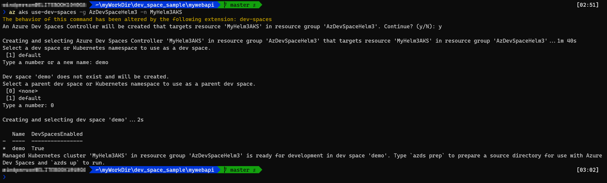
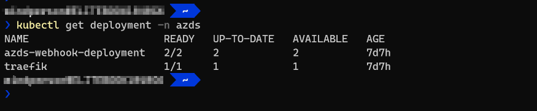
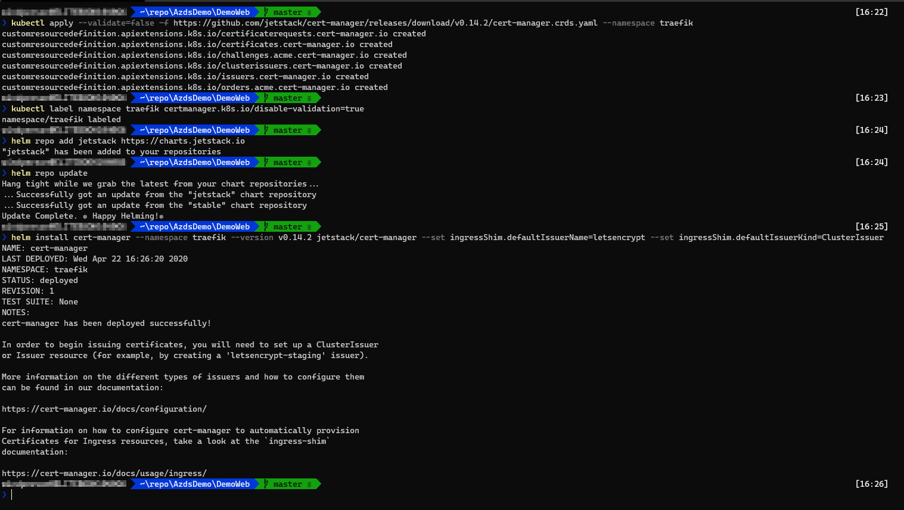
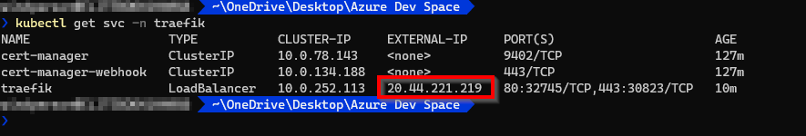
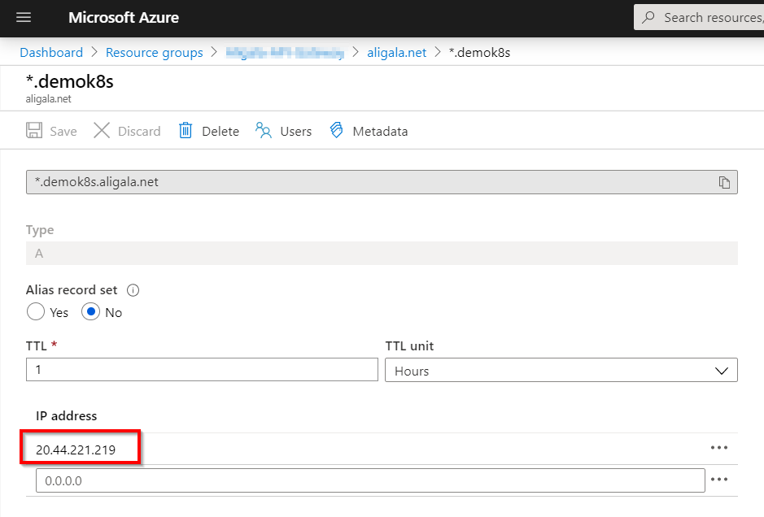
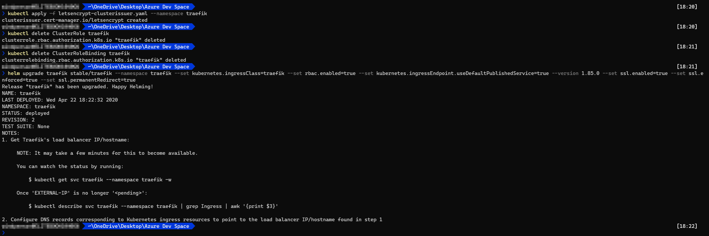

# Create Azure Dev Spaces

## Prerequisites

### Software
* Kubernetes command-line tool **kubectl**:   
https://kubernetes.io/docs/tasks/tools/install-kubectl/
* Kubernetes package manager & deploy tool **Helm** v3.0 or above:   
https://helm.sh/docs/intro/install/
* Azure CLI: https://aka.ms/azcli
* Azure Dev Spaces client-side tools:  
https://docs.microsoft.com/en-us/azure/dev-spaces/how-to/install-dev-spaces#install-the-client-side-tools
	* Windows: https://aka.ms/get-azds-windows
	* Mac: https://aka.ms/get-azds-mac
	* Linux: https://aka.ms/get-azds-linux
	
#### Optional:

* [Visual Studio Code](https://code.visualstudio.com/) and [Azure CLI Tools](https://marketplace.visualstudio.com/items?itemName=ms-vscode.azurecli) extension, so you can use ready-made [cli_commands.azcli](./cli_commands.azcli) script file in Visual Studio Code and it's integrated terminal.

### Azure Subscription

Be sure to do `az login` before following steps:   
https://docs.microsoft.com/en-us/cli/azure/authenticate-azure-cli

## Create Azure Kubernetes Service with Azure Dev Spaces enabled

### Enable Helm 3 preview feature

* Official doc:  
https://docs.microsoft.com/en-us/azure/dev-spaces/how-to/helm-3

1. Check if Helm3Preview is enabled:
	```shell
	az feature show --namespace Microsoft.DevSpaces --name Helm3Preview --output table
	```
	If `RegistrationState` is **Registered**, then the Helm3 support is turned ON, Skip next step.
2. Enable Helm3Preview feature:
	```shell
	az feature register --namespace Microsoft.DevSpaces --name Helm3Preview
	```
	Then try to check if Helm3Preview is enabled:
	```shell
	az feature show --namespace Microsoft.DevSpaces --name Helm3Preview --output table
	```
	Try check more times until you see the `RegistrationState` is **Registered**, Then refresh the registration of Microsoft.DevSpaces using `az provider register`:
	```shell
	az provider register --namespace Microsoft.DevSpaces
	```

### Create an AKS Service with Azure Dev Spaces enabled
1. Create AKS service:
    ```shell
    az aks create -g MyResourceGroupName -n MyAksServiceName --location SpecifiedAksSupportRegions --generate-ssh-keys
    ```
    Replace the above `MyResourceGroupName`, `MyAksServiceName`, `SpecifiedAksSupportRegions` with the desired Azure Resource Group Name, AKS Service Name, and [Azure Region that has Azure Dev Spaces support](https://azure.microsoft.com/en-us/global-infrastructure/services/?products=kubernetes-service).
2. Enable Azure Dev Spaces:
    ```shell
    az aks use-dev-spaces -g MyResourceGroupName -n MyAksServiceName
    ```
    
    Check if Azure Dev Spaces is enabled via kubectl:
    ```shell
    kubectl get deployment -n azds
    ```
    You should see `azds-webhook-deployment` & `traefik` deployment entries, but no `tiller` deployment.
    

  
## Enable custom domain name and HTTPS using Let's Encrypt on Azure Dev Spaces

* Official doc:  
https://docs.microsoft.com/en-us/azure/dev-spaces/how-to/ingress-https-traefik

1. Add official Helm repository:
    ```shell
    helm repo add stable https://kubernetes-charts.storage.googleapis.com/
    ```
2. Install [traefik](https://docs.traefik.io) ingress-controller service:
    ```shell
    helm install traefik stable/traefik --namespace traefik --set kubernetes.ingressClass=traefik --set rbac.enabled=true --set fullnameOverride=traefik --set kubernetes.ingressEndpoint.useDefaultPublishedService=true
    ```
3. Install [cert-manager](https://cert-manager.io) service for later on Let's Encrypt HTTPS SSL certificate acquisition:   
    **Note**: below is using [cert-manager v0.14.2 stable release](https://github.com/jetstack/cert-manager/releases/tag/v0.14.2).
    1. Import cert-manager YAML manifest file:
        ```shell
        kubectl apply --validate=false -f https://github.com/jetstack/cert-manager/releases/download/v0.14.2/cert-manager.crds.yaml --namespace traefik
        ```
    2. Disable K8S service validation for later on installation using Helm on traefik namespace:
        ```shell
        kubectl label namespace traefik certmanager.k8s.io/disable-validation=true
        ```
    3. Add cert-manager Helm repository:
        ```shell
        helm repo add jetstack https://charts.jetstack.io
        helm repo update
        ```
    4. Install cert-manager:
        ```shell
        helm install cert-manager --namespace traefik --version v0.14.2 jetstack/cert-manager --set ingressShim.defaultIssuerName=letsencrypt --set ingressShim.defaultIssuerKind=ClusterIssuer
        ```
    Below is the screen snapshot after finish above steps:   
    
4. Configure custom domain name for ingress URI:
    After doing above steps, the traefik service should have external reachable IP, run:
    ```shell
    kubectl get svc -n traefik
    ```
    to get that like following:
       
    Add the external IP as an "[A Record](https://support.dnsimple.com/articles/a-record/)" in your DNS management service:   
    
5. Enable Let's Encrypt HTTPS SSL certificate on traefik:
    1. Create or using the existing kubectl config file: [letsencrypt-clusterissuer.yaml](./letsencrypt-clusterissuer.yaml)
        ```YAML
        apiVersion: cert-manager.io/v1alpha2
        kind: ClusterIssuer
        metadata:
          name: letsencrypt
        spec:
          acme:
          server: https://acme-v02.api.letsencrypt.org/directory
          email: <Replace_with_your_letsencrypt_registration_email>
          privateKeySecretRef:
            name: letsencrypt
          solvers:
           - http01:
               ingress:
                 class: traefik
        ```
        Be sure to replace the `<Replace_with_your_letsencrypt_registration_email>` with a valid e-mail for [Let's Encrypt Expiration Email registration](https://letsencrypt.org/docs/expiration-emails).
    2. Apply config file:
        ```shell
        kubectl apply -f letsencrypt-clusterissuer.yaml --namespace traefik
        ```
    3. Redeploy traefik service to apply setting:
        ```shell
        kubectl delete ClusterRole traefik
        kubectl delete ClusterRoleBinding traefik
        helm upgrade traefik stable/traefik --namespace traefik --set kubernetes.ingressClass=traefik --set rbac.enabled=true --set kubernetes.ingressEndpoint.useDefaultPublishedService=true --version 1.85.0 --set ssl.enabled=true --set ssl.enforced=true --set ssl.permanentRedirect=true
        ```
    Below is the screen snapshot after finish above steps:   
    
    **Note**: the External IP address may be changed after `helm upgrade traefik...` instruction, so be sure to check IP address again and update the DNS A record in your DNS management service accordingly.